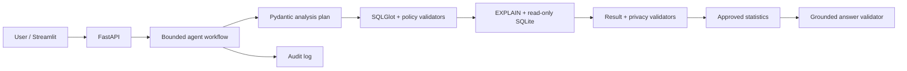
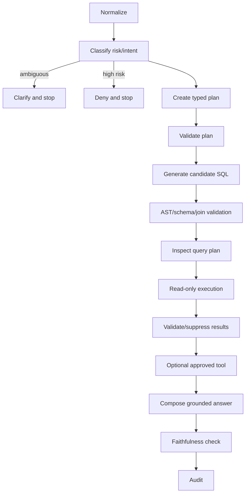
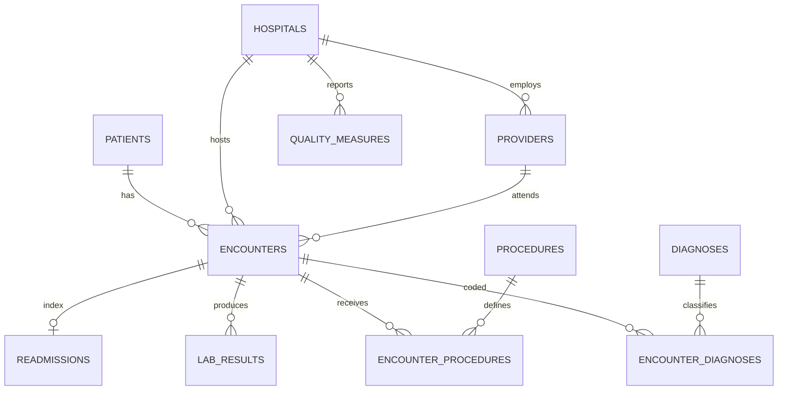

# Agentic Clinical SQL Analyst

[](#testing) [](#quick-start) [](LICENSE)

A portfolio-grade, constrained analytics agent that turns natural-language questions into typed analysis plans, validated read-only SQL, verified statistics, and evidence-grounded answers over an entirely synthetic healthcare database. It demonstrates relational design, practical SQL, agentic orchestration, FastAPI, Streamlit, statistical tooling, Docker, CI, auditability, and explainability—without requiring a paid service to launch.

> **Synthetic data only. Educational/portfolio software, not a clinical decision system.** No record represents a real patient, provider, or hospital.

## Screenshots

| Analysis workspace | Validation and audit |
|---|---|
| _Add `docs/screenshots/analysis.png`_ | _Add `docs/screenshots/audit.png`_ |

## Why this exists

Text-to-SQL demos often give a model excessive authority and trust plausible-looking output. This project separates interpretation from authority. The agent can propose a registered metric and SQL candidate, but deterministic code decides whether the query may run, recomputes important quantities, suppresses small cells, and checks whether the answer is supported.

### Key features

- 12-table normalized SQLite model, foreign keys, checks, indexes, views, and reproducible synthetic data
- Credential-free deterministic agent supporting curated analytical questions against the real database
- Pydantic analysis plans before SQL; ambiguity such as “Which hospital is worst?” triggers clarification
- SQLGlot single-statement AST checks, table/column/function allowlists, join/resource controls, and row limits
- SQLite URI read-only mode, `query_only`, timeout progress handler, and `EXPLAIN QUERY PLAN`
- Registered healthcare metrics and fixed statistical tools; arbitrary generated Python never runs
- Result plausibility checks, deterministic arithmetic, small-cell suppression, grounded answer templates
- FastAPI/OpenAPI, polished Streamlit UI, JSON audit trail, benchmarks, pytest, Docker Compose, and CI
- 20 annotated reference queries covering joins, CTEs, subqueries, date logic, views, indexes, and windows

## Architecture







Safeguards stack from outside inward: **privacy classification → typed plan → metric registry → AST/schema/join allowlists → plan inspection/resource caps → read-only database → result checks/suppression → fixed statistics → answer faithfulness → immutable provenance record**.

## Database and SQL

`patients`, `hospitals`, `providers`, and `encounters` form the core. Diagnoses and procedures use normalized vocabularies with many-to-many bridge tables. Labs, readmissions, quarterly quality measures, and audits are separate facts. The seeded full profile creates approximately 25,000 patients, 30 hospitals, 200 providers, and 100,000 encounters. Hospital risk, diagnosis, age proxy, rurality, seasonality, and temporal trends generate useful analytical variation. Controlled missingness, suspicious dates, rare categories, inconsistent codes, and small cohorts support quality tests.

The [reference curriculum](sql/reference_queries/README.md) visibly demonstrates `SELECT`, filtering, sorting, grouping, `HAVING`, inner/left joins, CTEs, subqueries, `CASE`, dates, aggregates, `ROW_NUMBER`, `RANK`, `DENSE_RANK`, `LAG`, rolling windows, views, parameterization, indexes, and `EXPLAIN QUERY PLAN`. Database construction uses an explicit transaction.

## What is agentic—and what is not

The workflow observes state, selects a bounded path, can request clarification, chooses a registered metric/tool, and records structured actions. It is not fully autonomous: retry limits are finite (two SQL repairs, one result repair, one evidence-only answer rewrite as extension contracts), high-risk requests terminate, and deterministic components retain execution authority. The trace shows decisions, validators, tool calls, warnings, and retry reasons—not hidden chain-of-thought.

The LLM does **not** directly execute unrestricted SQL. Generated SQL is parsed before execution; the database handle is read-only. The model cannot redefine metrics, calculate final rates, run arbitrary Python, expose small groups, or add claims absent from verified evidence. Model self-critique is secondary because a model can confidently repeat its own mistake.

The baseline demo is intentionally deterministic. When a session-only API key is supplied, non-demo questions use the OpenAI Responses API with Pydantic Structured Outputs to propose an `AnalysisPlan` and one SQL candidate. That candidate passes through exactly the same non-bypassable deterministic pipeline; OpenAI never receives a database connection and the API key is never logged. Curated questions remain deterministic for reproducible demonstrations.

## Metrics, privacy, statistics, and provenance

The registry fixes numerator, denominator, eligibility, sample size, unit, grouping, null handling, and caveats for readmission, mortality, complications, length of stay, emergency conversion, cost, volume, and prevalence. Rates are checked and important ratios are computed from numerator/denominator output.

Aggregate results are the default. Direct identifiers and patient-level exports are high risk and denied. Sensitive demographic combinations are medium risk, explicitly warned, and groups under 10 are suppressed. Only the minimum result fields needed for an answer should reach a live model.

Approved tools include Wilson proportion intervals, chi-square, Fisher exact, Welch t-test, Mann–Whitney U, one-way ANOVA, and Pearson/Spearman correlations. Each validates types/sample size and returns structured estimates, effects, assumptions, and warnings. Regression and standardization are documented extension points in this MVP.

Every run receives an ID and records question, normalized intent, model label, schema version, plan, SQL, validation/execution status, timing, row count, statistical tool, warnings, answer, and timestamp. API keys are excluded.

## Example

Question: “Which hospitals had the highest 30-day readmission rates for heart failure in 2025?”

```sql
WITH cohort AS (... validated eligibility joins ...)
SELECT hospital_name, COUNT(*) AS denominator,
       SUM(readmitted_within_30_days) AS numerator,
       1.0 * SUM(readmitted_within_30_days) / COUNT(*) AS readmission_rate
FROM cohort JOIN hospitals USING (hospital_id)
GROUP BY hospital_id, hospital_name
HAVING COUNT(*) >= 10
ORDER BY readmission_rate DESC;
```

Output includes the direct answer, verified table/chart, sample size, fixed metric definition, caveats, exact validated SQL, referenced tables/columns, optional test result, trace, query-plan provenance, and audit ID. If evidence is empty or inconclusive, the answer says so.

## Quick start

```bash
python -m venv .venv
# Windows: .venv\Scripts\activate
# macOS/Linux: source .venv/bin/activate
python -m pip install -e ".[dev]"
python -m src.database.seed --patients 2500 --encounters 10000
uvicorn src.api.main:app --reload
```

Open [http://localhost:8000/docs](http://localhost:8000/docs). In another terminal:

```bash
streamlit run app.py
```

Open [http://localhost:8501](http://localhost:8501). No key is required. For the full dataset, run `python -m src.database.seed` (100,000 encounters). Configuration lives in [.env.example](.env.example); never commit `.env`.

### Testing and benchmark

```bash
python -m pytest
python -m src.cli benchmark
```

The seed benchmark spans aggregation, joins, rates, cohorts, ambiguity, privacy denial, statistics, and prompt injection. It reports executable SQL rate, exact table selection, clarification/denial accuracy, and latency. See [evaluation design](docs/evaluation.md). Benchmark results are intentionally a placeholder until run in CI against a pinned release artifact.

### Docker

```bash
docker compose up --build
```

API: port 8000; UI: port 8501; generated data uses a named volume.

## API

| Method | Path | Purpose |
|---|---|---|
| GET | `/`, `/health` | metadata and readiness |
| GET | `/schema`, `/metrics` | allowlisted schema and registry |
| POST | `/analyze` | execute the bounded workflow |
| POST | `/validate-sql` | validate without execution |
| GET | `/runs`, `/runs/{run_id}` | audit provenance |
| GET | `/reference-queries` | curriculum discovery |
| POST | `/demo/reset` | safely refuses destructive HTTP reset |

Full contracts are in OpenAPI and [docs/api.md](docs/api.md).

## Project map

`src/agent` owns typed orchestration; `src/safety` deterministic policy; `src/database` creation/read-only access; `src/metrics` immutable definitions; `src/statistics` fixed tools; `src/audit` provenance; `src/api` FastAPI; `src/ui` Streamlit; `src/evaluation` benchmarks; `sql` schema/views/indexes/reference queries; `tests` regression coverage; `docs` design detail.

## Design decisions, limits, and production hardening

SQLite makes the demo portable and inspectable; PostgreSQL should use a dedicated SELECT-only role and statement timeout. Curated SQL makes credential-free behavior reproducible. SQLGlot provides structural checks that regex cannot, though policy remains conservative. FastAPI supplies typed service contracts while Streamlit optimizes portfolio exploration.

Known limits: live planning requires network access, API credit, and access to the configured OpenAI model; relationship validation is conservative; statistics are unadjusted; no causal or clinical inference is intended; benchmark breadth should grow beyond the seed fixture; logistic/linear regression and standardized rates remain registry extensions; SQLite timeouts are cooperative; audit rows are not cryptographically tamper-evident. Production requires identity, authorization, encrypted/tamper-evident audit storage, migrations, PostgreSQL permissions/RLS, monitoring, reviewed metric governance, model/version pinning, red-team evaluation, approval queues, and incident response.

## Resume-ready description

**Agentic Clinical SQL Analyst: Designed a normalized healthcare database and a constrained LangGraph agent that converts natural-language questions into validated read-only SQL, executes multi-table analytics, invokes approved statistical tools, checks result plausibility, repairs failed queries, enforces privacy safeguards, and returns evidence-grounded findings with query provenance and audit trails.**

## Interview talking points

- Explain normalization, bridge tables, foreign keys, checks, index selection, views, and why cohorts use explicit primary-diagnosis logic.
- Walk through joins, CTEs, date calculations, `HAVING`, and window functions in `sql/reference_queries`.
- Describe natural-language-to-SQL as plan selection plus constrained compilation—not direct model execution.
- SQLGlot gives an AST for statement type, references, joins, functions, complexity, and rewriting; regex is only supplemental.
- Read-only permissions contain validator defects; query limits and timeouts contain resource abuse.
- Self-critique is probabilistic and correlated with generation errors, so deterministic policy and arithmetic stay authoritative.
- Contrast LLM duties (interpretation/candidate generation) with code duties (permission, computation, suppression, validation).
- Discuss test selection, assumptions, effects, confidence intervals, missingness, and why unadjusted significance is limited.
- Explain small-cell suppression, high-risk denial, data minimization, bounded retries, and structured audit provenance.
- FastAPI separates reusable contracts; Streamlit makes evidence and safeguards legible to reviewers.
- Docker provides reproducibility; GitHub Actions seeds, tests, measures coverage, and smoke-runs evaluation.

## Security and clinical disclaimer

This is a defense-in-depth educational prototype, not a security certification. It uses synthetic data only and must not receive PHI. It is not validated for patient care, diagnosis, treatment, operational decisions, regulatory reporting, or hospital comparison. Review SQL, metrics, and outputs with qualified domain experts.

MIT licensed. Contributions are welcome under [CONTRIBUTING.md](CONTRIBUTING.md).
